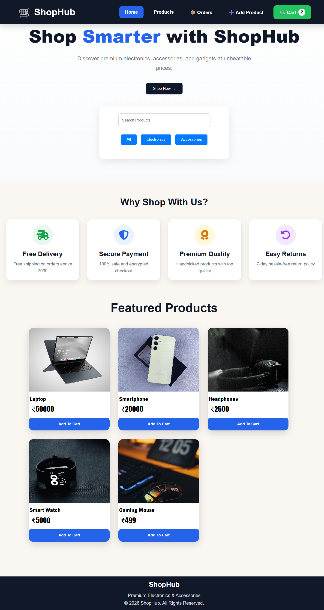
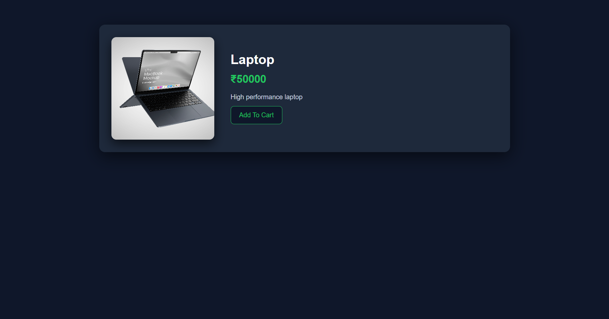
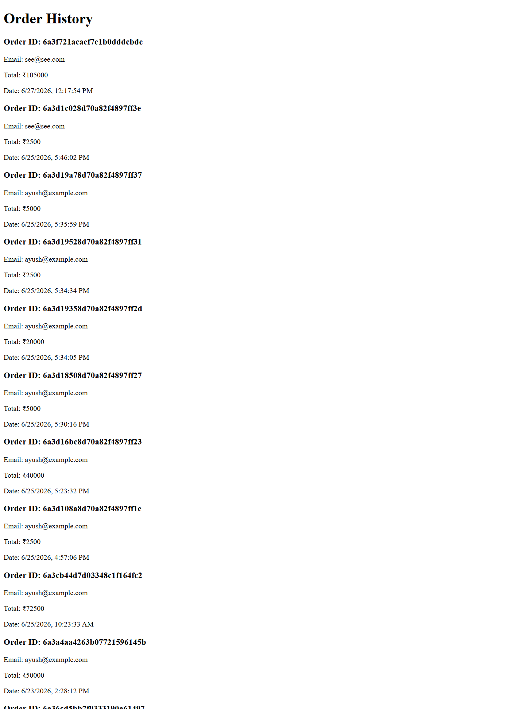

#  🛒 ShopHub - Full Stack E-Commerce Website

A modern full-stack E-Commerce web application built using Node.js, Express.js, MongoDB, HTML, CSS, and JavaScript.

This project was developed during the CodeAlpha Full Stack Development Internship.
---

## - Features

### 👤 Authentication
- User Registration
- User Login
- Secure Password Hashing using bcryptjs
- Session-based user management using Local Storage

### - Product Management
- View all products
- Product Details Page
- Add New Products
- Product Search
- Product Filtering

### - Shopping Cart
- Add to Cart
- Increase Quantity
- Decrease Quantity
- Remove Items
- Clear Cart
- Dynamic Total Calculation

### - Order Processing
- Checkout Functionality
- Store Orders in MongoDB
- Order History Page
- View Previous Orders

### - Responsive UI
- Modern Design
- Mobile Responsive Layout
- Interactive Product Cards
- Hover Effects and Animations

---

# 🛠️ Tech Stack

## Frontend
- HTML5
- CSS3
- JavaScript (ES6)

## Backend
- Node.js
- Express.js

## Database
- MongoDB
- Mongoose

## Authentication
- bcryptjs

---

# 📸 Screenshots

## 🏠 Home Page



---

## 📦 Product Details Page


---

## 🛒 Shopping Cart


---

## 📋 Orders Page



---

## 🔐 Login Page


---

## 📝 Register Page


---

# 📂 Project Structure

```text
Ecommerce-website/
│
├── models/
│   ├── Product.js
│   ├── Order.js
│   └── user.js
│
├── public/
│   ├── css/
│   ├── js/
│   ├── images/
│   ├── index.html
│   ├── product.html
│   ├── cart.html
│   ├── orders.html
│   ├── login.html
│   ├── register.html
│   └── add-product.html
│
├── server.js
├── package.json
├── package-lock.json
└── README.md
```

---

# ⚙️ Installation

## Clone Repository

```bash
git clone https://github.com/Ayushlevel/Ecommerce-website.git
```

## Move into Project

```bash
cd Ecommerce-website
```

## Install Dependencies

```bash
npm install
```

## Create Environment Variables

Create a `.env` file in the root folder:

```env
MONGO_URI=your_mongodb_connection_string
```

---

## Run Project

```bash
node server.js
```

Server starts at:

```text
http://localhost:3000
```

---

# 🗄️ Database Collections

The application uses MongoDB collections for:

### Users

```json
{
  "name": "Ayush",
  "email": "ayush@example.com",
  "password": "hashedPassword"
}
```

### Products

```json
{
  "name": "Laptop",
  "price": 50000,
  "image": "image-url",
  "description": "High performance laptop"
}
```

### Orders

```json
{
  "userEmail": "ayush@example.com",
  "items": [],
  "totalAmount": 50000
}
```

---

# Key Features

- Product Listings
- Product Details Page 
- Shopping Cart 
- Order Processing 
- User Registration/Login 
- MongoDB Database Integration 
- Express.js Backend 

---

# 🎯 Future Improvements

- Payment Gateway Integration
- Admin Dashboard
- Product Categories
- Wishlist
- Product Reviews
- JWT Authentication
- Cloud Deployment

---

# 👨‍💻 Author

### Ayushman Yadav

GitHub:
https://github.com/Ayushlevel

---

# ⭐ Support

If you like this project, please give it a star on GitHub.